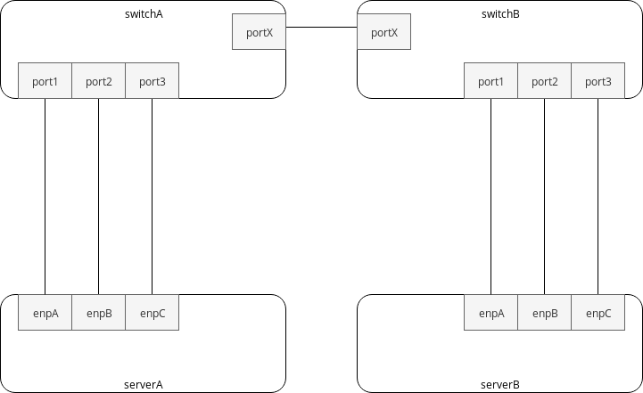

.. _system-config-intro:

Overview
========

The following sections present the intended way to configure several networking scenarios on BISDN Linux.

These examples are designed to be used with up to two Basebox controllers (on-switch) and two physical servers. To increase flexibility Linux namespaces are used to simulate multiple hosts inside the servers. All of the following examples are designed to be executed with the same physical topology, shown in the following diagram.

  
  Example topology for Basebox.

This architecture allows to flexibly simulate several networking configurations, across different supported BISDN Linux platforms.

